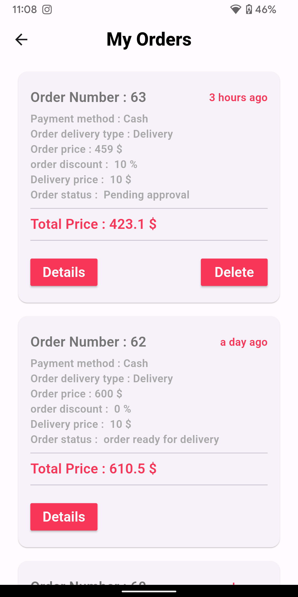

# Multi Vendor Ecommerce App
it's multi vendor ecommerce using Getx, sql (MySql), php, firebase and maps .

## Features
- authentication
- forget password and OTP verification
- locelization (arabic , english)
- get products and their details and describtion
- get products categories
- search for a product
- adding products to favorites and cart
- notifications using firebase
- manage orders between clint, delivery and admin
- address using google maps and places API
- using php and MySql for API and database
  

## Technologies
- flutter / dart
- php / MySql
- APIs
- google maps / places API
- firebase
- authentication
- notifications
- locelization
- OTP / forget password
- animation
- http / dio
- version controll
- postman

## Screenshots
           
           
           
           
           
           
           
           

